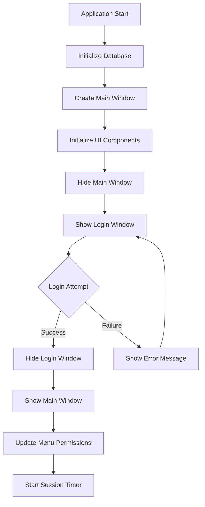
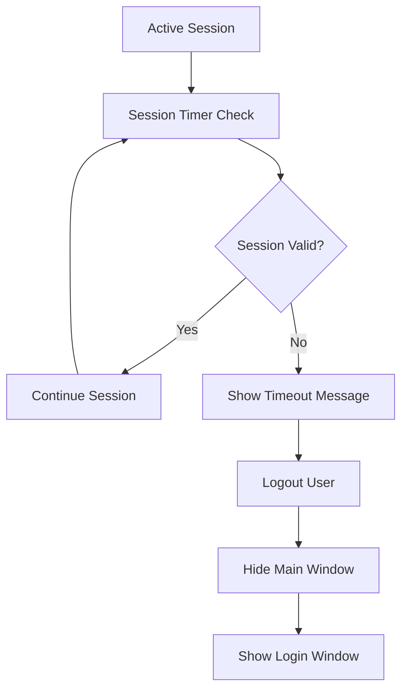
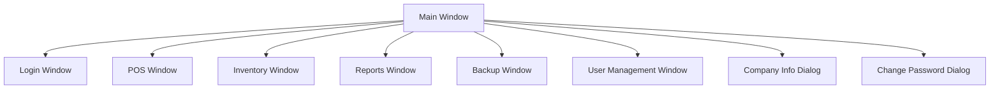
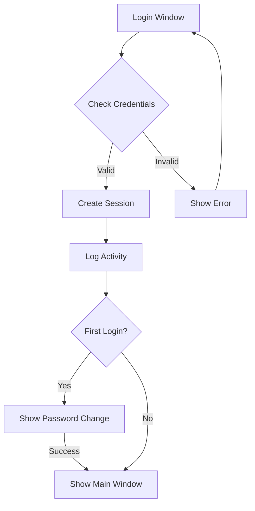
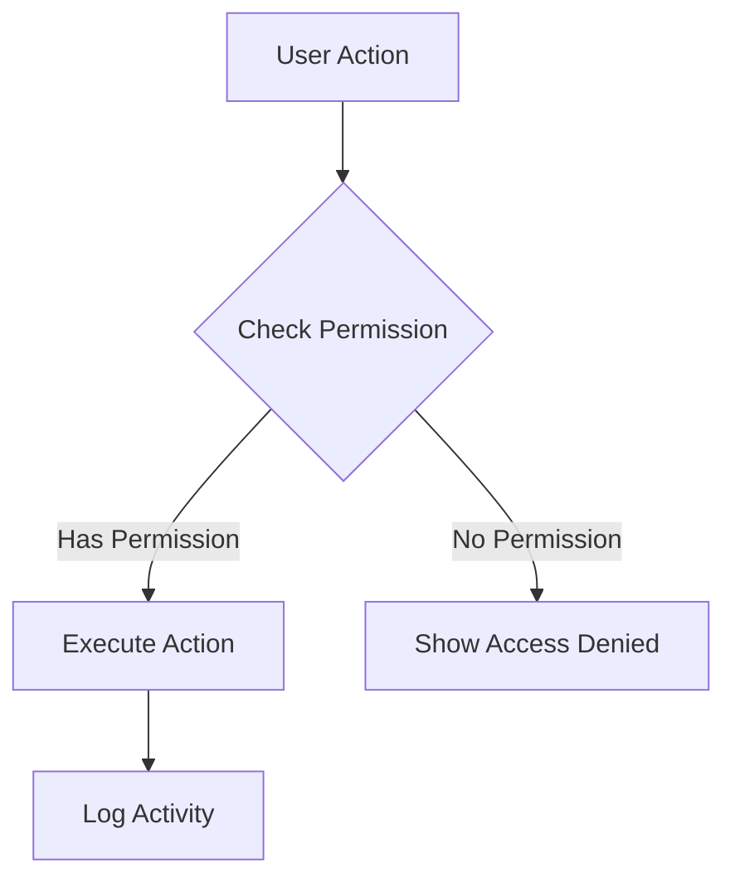
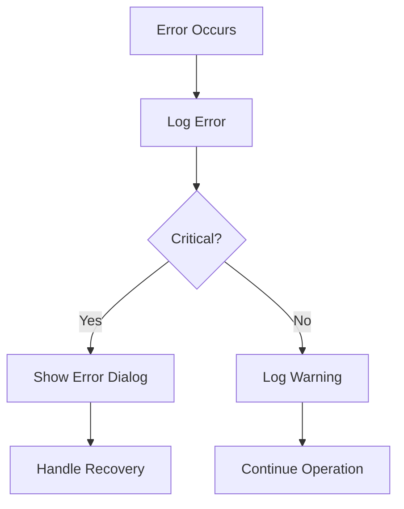

# Terran POS System - Application Flow

This document describes the flow of the Terran POS System application, including window management, user authentication, and session handling.

## Application Startup Flow

## Session Management Flow

## Window Hierarchy

## User Authentication Flow

## Permission Check Flow

## Window States

| Window | Initial State | Post-Login | On Logout |
|--------|--------------|------------|-----------|
| Main Window | Hidden | Visible | Hidden |
| Login Window | Visible | Hidden | Visible |
| Other Windows | N/A | On-Demand | Auto-Close |

## Key Features

1. **Single Window Focus**
   - Only one main operational window visible at startup (Login)
   - Main window appears only after successful authentication

2. **Session Management**
   - Automatic session timeout checks
   - Secure session token handling
   - IP-based session tracking

3. **Window Transitions**
   - Smooth transitions between windows
   - Proper cleanup on window changes
   - State preservation during session

4. **Security**
   - Role-based access control
   - Permission checks on all operations
   - Activity logging
   - Session timeout handling

## Error Handling

## Notes

1. **Window Management**
   - All windows inherit from QMainWindow
   - Consistent dark theme across windows
   - Centralized error handling

2. **Session Handling**
   - 60-minute session timeout
   - Automatic session validation
   - Secure token management

3. **User Experience**
   - Intuitive window transitions
   - Clear error messages
   - Consistent UI/UX 