# Hotel Concept Study
---
## 1. Hotel Management

```mermaid
graph TD
	A[Bookings & Reservations] --> B1[Room Reservations]
	A --> B2[Channel Management]
	A --> B3[Dynamic Pricing]
	
	C[Front Desk Management] --> D1[Check-In/Check-Out]
	C --> D2[Guest Profiles]
	
	E[Inventory Management] --> F1[Rooms]
	E --> F2[Supplies]
	E --> F3[Food & Beverage]
	
	G[Food & Beverage Management] --> H1[POS System]
	G --> H2[Bar Inventory]
	G --> H3[Room Service]
	
	I[Staff & Operations Management] --> J1[Housekeeping]
	I --> J2[Shift Schedules]
	
	K[Financial Management] --> L1[Billing]
	K --> L2[Reports]
	
	M[Guest Experience] --> N1[Feedback Collection]
	M --> N2[Loyalty Programs]
```



## 2.Software Side Hotel Management

```mermaid
graph TD
    A[Booking Engine] --> B[Bookings & Reservations]
    
    C[PMS (Property Management System)] --> D[Front Desk Management]
    C --> E[Inventory Management]
    
    F[POS System] --> G[Food & Beverage Management]
    
    H[Inventory Management Module] --> E[Inventory Management]
    
    I[Financial Reports & Billing] --> J[Financial Management]
    
    K[Guest Feedback & Loyalty] --> L[Guest Experience]
    
    M[Mobile Access] --> B[Bookings & Reservations]
    M --> D[Front Desk Management]
    M --> E[Inventory Management]
    M --> G[Food & Beverage Management]
    M --> J[Financial Management]
    M --> L[Guest Experience]
```
